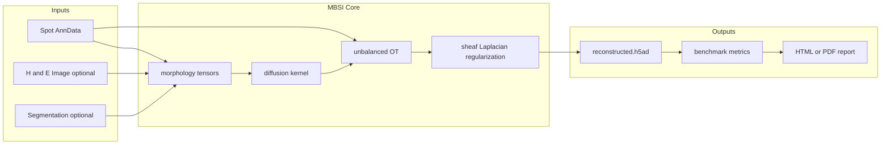

# MBSI Studio — Project Overview

**MBSI Studio** (Morpho-Biophysical Sheaf Integration) is an alpha-stage Python research platform for physics-aware super-resolution of spatial transcriptomics. It deconvolves spot-level expression (e.g. 10x Visium) into pseudo single-cell resolution using anisotropic diffusion, unbalanced optimal transport, and sheaf-based graph regularization — exposed via a Milestone 1 SaaS Streamlit shell, FastAPI backend, Python API, and CLI scripts.

Repository: https://github.com/fredoc20231-cmyk/MBSI-Studio

---

## What It Is

Given spots with mixed expression, MBSI infers where expression likely belongs at finer spatial resolution by combining tissue morphology, diffusion physics, optimal transport, and graph/sheaf regularization.



---

## Tech Stack

| Layer | Technology |
| ----- | ---------- |
| Language | Python 3.10+ (target 3.11) |
| Scientific stack | scanpy, anndata, numpy, scipy, scikit-learn, scikit-image, POT, networkx, torch |
| UI | Streamlit SaaS shell (`app/streamlit_app.py` → `app/components/saas_shell.py`) |
| Primary API | FastAPI + uvicorn (`mbsi/api/app.py`) |
| Legacy API | FastAPI (`mbsi/api/main.py`) — backward compatibility only |
| Deployment | Docker + docker-compose (ports 8501 UI, 8000 API) |
| Tests | pytest (`tests/`) with `heavy` and `integration` markers |
| Packaging | setuptools via `pyproject.toml` (v0.2.0) |

---

## Milestone 1 UI (Primary)

The default Streamlit experience is the **SaaS shell** with workspace modules — not the legacy numbered page workflow (`01_dashboard.py` … `10_export.py`).

| Workspace | Module key | Role |
| --------- | ---------- | ---- |
| Study Setup & Data | `study_data` | Project setup, sample table, technology-aware upload |
| QC & Transformation | `qc_transformation` | QC summary, filtering, normalization |
| Segmentation & Registration | `segment_register` | Tissue/cell segmentation, image registration |
| Spatial Analysis | `spatial_analysis` | Spatial maps, clustering, feature plots |
| Reconstruction | `reconstruction` | Physics-aware MBSI cell reconstruction |
| Benchmark & Validation | `benchmark` | Ground-truth metrics and validation |
| Discovery Intelligence | `discovery` | Communication, TME, biomarkers (experimental) |
| AI Review & Evidence | `ai_review` | Grounded outcome Q&A |
| Report & Export | `report_export` | Notebook, HTML/PDF, data bundles |
| Settings | `settings` | Session, theme, export defaults |

**Legacy pages** under `app/pages/` remain for developer/reference use. Enable with `DEVELOPER_MODE=true` or `MBSI_DASHBOARD=true`.

---

## Production vs Developer Mode

| Mode | Env | Behavior |
| ---- | --- | -------- |
| **Production** (default) | none | Real uploads only; demo/synthetic features blocked |
| **Developer** | `DEVELOPER_MODE=true` | Demo loaders, synthetic dashboards, reference cockpit |

Implementation: `app/components/developer_mode.py`.

---

## Core Algorithm (`mbsi/reconstruction/solver.py`)

Main entry points: `run_mbsi()` (single-pass) and `run_iterative_mbsi()` (alternating OT + sheaf).

1. **Pseudo-cell generation** — Places `n_cells_per_spot` points around each spot center when no cell coordinates are provided.
2. **Diffusion kernel** — Anisotropic (H&E morphology via `mbsi/morphology/`) or Euclidean Gaussian baseline.
3. **Optimal transport** — Unbalanced Sinkhorn OT via `mbsi/transport/unbalanced_ot.py` (POT).
4. **Expression deconvolution** — `X_cells = T^T @ X_spots`
5. **Sheaf regularization** (when `use_sheaf=True` and `lambda_sheaf > 0`) — Builds k-NN cell graph, then solves `(I + λL)X = X₀` using the graph Laplacian from `mbsi/sheaf/sheaf_laplacian.py`. Objective matches `mbsi/sheaf/regularizer.py`.

`run_iterative_mbsi()` alternates OT and sheaf steps for `max_outer_iter` rounds instead of delegating to a single pass.

---

## Segmentation Stack (`mbsi/segmentation/`)

Production segmentation for Milestone 1 Visium/Xenium workflows:

| Component | Purpose |
| --------- | ------- |
| `tissue.py`, `cells.py`, `nuclei.py` | Classical tissue/cell/nuclei segmentation |
| `stardist_pipeline.py`, `cellpose_pipeline.py` | Deep-learning pipelines |
| `deepcell_mesmer_pipeline.py`, `baseline_unet.py` | Additional model backends |
| `boundaries.py` | Xenium boundary handling |
| `registration.py` | Image-to-spot registration |
| `qc.py`, `export.py`, `importers.py` | QC, export, mask import |

Wired to the **Segmentation & Registration** workspace and `/api/workflow/run` segmentation modules.

---

## Package Structure (`mbsi/`)

| Module | Purpose |
| ------ | ------- |
| `mbsi/io/` | Load Visium, Xenium, h5ad, CSV; validate AnnData |
| `mbsi/qc/` | QC pipelines for Milestone 1 ingest |
| `mbsi/morphology/` | Image features, diffusion tensors |
| `mbsi/diffusion/` | Anisotropic/Euclidean kernels |
| `mbsi/transport/` | Balanced/unbalanced Sinkhorn OT |
| `mbsi/sheaf/` | Cell graphs, Laplacian, regularization terms |
| `mbsi/reconstruction/` | Main solver + postprocessing |
| `mbsi/segmentation/` | Segmentation and registration pipelines |
| `mbsi/benchmarks/` | Pseudo-Visium, metrics, ablation, competitors |
| `mbsi/visualization/` | Spatial plots, reports |
| `mbsi/api/` | FastAPI routes, schemas, file-based job store |
| `mbsi/registry/` | Project/dataset registry |
| `mbsi/workflows/` | Start Analysis pipeline orchestration |

Research/experimental modules (causal, digital twin, foundation models, etc.) are documented in [RESEARCH_MODULES.md](RESEARCH_MODULES.md).

---

## API Backends

### Primary — `mbsi/api/app.py`

Started by `./scripts/run_api.sh`, Docker, and `docker-compose.yml`:

- `GET /health`, `/api/health`
- `GET /api/technologies`
- `POST /api/project/create`, `/api/project/update`
- `POST /api/dataset/upload`, `/api/dataset/inspect`
- `GET /api/dataset/readiness`
- `POST /api/workflow/run`, `GET /api/workflow/status`
- `POST /api/report/generate`

See [MBSI_API_MILESTONE1.md](MBSI_API_MILESTONE1.md) for full contract.

### Legacy — `mbsi/api/main.py`

Backward-compatible routes not started by Docker default:

- `POST /upload`, `/run-mbsi`, `/validate`, `/benchmark`
- `GET /download/{job_id}`
- Advanced: segmentation, causal, temporal, digital twin, copilot, etc.

### Job Storage — `mbsi/api/job_store.py`

File-based persistence under `data/uploads/{job_id}/job.json`. AnnData objects stored as h5ad and loaded on demand. Path traversal and unsafe job IDs are rejected.

---

## Benchmarking & Validation (`mbsi/benchmarks/`)

- **Pseudo-Visium** (`pseudo_visium.py`): aggregate single-cell ground truth into synthetic spots.
- **Metrics** (`metrics.py`): Pearson/Spearman, RMSE, R², spatial correlation, marker localization, Moran's I, boundary leakage, cell-type accuracy.
- **Cell-count alignment**: when ground truth and reconstruction differ in cell count, `align_reconstruction_to_truth()` aggregates reconstructed cells onto true locations so spatial metrics are not null.
- **Baselines** (`competitors.py`): uniform, distance-weighted, nearest-neighbor, linear interpolation.
- **Ablation** (`ablation.py`): parameter sweeps.

---

## CI (`.github/workflows/ci.yml`)

On push/PR to `main`:

1. Install package with dev dependencies
2. Run `scripts/smoke_test_launch_imports.py`
3. Run `pytest -m "not heavy and not integration" -q`

Heavy reconstruction and integration tests are excluded from the default CI gate.

---

## Scripts & Demo

| Script | Purpose |
| ------ | ------- |
| `scripts/run_demo.py` | Synthetic dataset + full pipeline + metrics |
| `scripts/run_benchmark.py` | Benchmark suite CLI |
| `scripts/run_api.sh` | Start Milestone 1 API |
| `scripts/start_ui.sh` | Start Streamlit SaaS shell |

Quick start:

```bash
pip install -e ".[dev]"
./scripts/run_api.sh
SAFE=1 ./scripts/start_ui.sh
# or: docker compose up --build
```

---

## Data Directories

| Path | Purpose |
| ---- | ------- |
| `data/demo/` | Synthetic demo outputs (e.g. `metrics.json`) |
| `data/uploads/` | API/user uploads + job metadata (runtime) |
| `data/outputs/` | Reconstruction and report outputs (runtime) |
| `data/registry/` | Project/dataset registry (runtime) |

---

## Current State Summary

**Strengths:**

- End-to-end Milestone 1 architecture: ingest, QC, segmentation, spatial analysis, reconstruction, validation, UI, API, Docker, CI
- Modular design with clear separation of diffusion / transport / sheaf / benchmarks
- File-based job persistence with path validation
- Spatial benchmark metrics handle mismatched cell counts via nearest-neighbor alignment

**Alpha limitations:**

- Full block-diagonal sheaf Laplacian with restriction maps is scaffolded but the production solver uses per-gene graph Laplacian regularization (efficient closed-form solve)
- Iterative MBSI alternates OT + sheaf but does not jointly optimize transport costs from smoothed expression
- Research modules (causal, digital twin, foundation) are not Milestone 1 production paths

**Version:** 0.2.0, Development Status Alpha (MIT license)

---

## Related Docs

- [USER_GUIDE.md](USER_GUIDE.md) — Milestone 1 workflow guide
- [MBSI_API_MILESTONE1.md](MBSI_API_MILESTONE1.md) — API contract
- [MBSI_UI_SPEC_MILESTONE1.md](MBSI_UI_SPEC_MILESTONE1.md) — UI specification
- [RESEARCH_MODULES.md](RESEARCH_MODULES.md) — Research/experimental module triage
- [MILESTONE_1_VISIUM_XENIUM_REAL_DATA.md](MILESTONE_1_VISIUM_XENIUM_REAL_DATA.md) — Real-data ingestion notes
